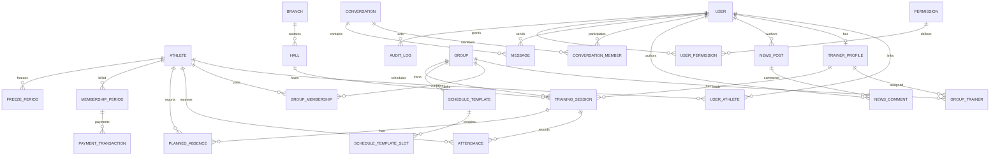

# 22. ERD v1

## Notes
- Branch и Hall разделены, хотя MVP использует фактическую связь 1:1.
- GroupMembership сохраняется исторически; одновременно допускается одна активная запись на Athlete.
- MembershipPeriod идентифицируется athlete + year + month.
- FreezePeriod хранит effective dates отдельно от created_at/updated_at.
- TrainingSession — материализованный экземпляр занятия; изменения экземпляра не меняют ScheduleTemplate.
